<p align="center">
  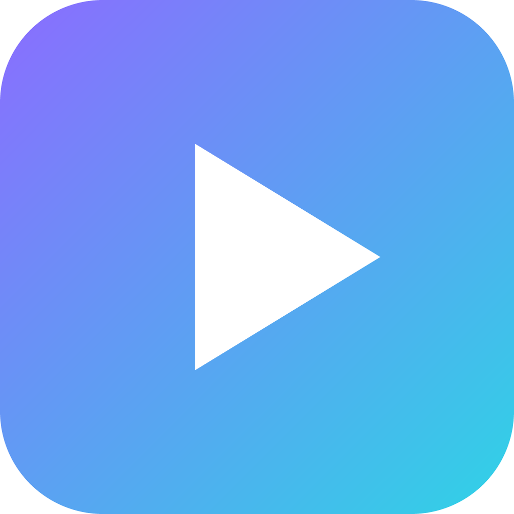
</p>

<h1 align="center">ContentStudio</h1>

<p align="center">
  <b>Thumbnails, Schnitt und Planung für Creator – lokal auf deinem Rechner, mit deiner eigenen KI.</b><br>
  <i>Thumbnails, editing and planning for creators – local on your computer, with your own AI.</i>
</p>

<p align="center">
  <a href="https://github.com/MoinMornhart/contentstudio/releases/latest"></a>
  
  
  <a href="LICENSE"></a>
</p>

<p align="center">
  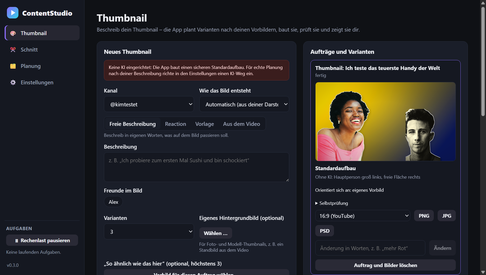
</p>

ContentStudio ist der verallgemeinerte Nachbau von [MoinStudio](https://github.com/MoinMornhart/moinstudio): gleicher
Funktionsumfang, aber für **jeden** Creator – Gaming, Vlog, Kochen, Bildung, Tech, Musik, Reactions, Streams –, jede
Plattform, jeden KI-Anbieter und fast jede Hardware. Die Oberfläche gibt es auf Deutsch und Englisch.

> **Stand:** Fundament, Creator-Profil, KI-Schicht, Thumbnails, Schnitt, Planung und Export in Schnittprogramme sind
> fertig. Als Nächstes: Qualitätsrunde und Version 1.0.
> Fortschritt: [ROADMAP](ROADMAP.md) · Änderungen: [CHANGELOG](CHANGELOG.md)

## Thumbnails

Beschreib dein Thumbnail in eigenen Worten. ContentStudio plant mehrere Varianten nach den Vorbildern deines Kanals,
baut sie, prüft sie selbst und zeigt dir nur, was die Prüfung besteht.

<table>
  <tr>
    <td width="50%">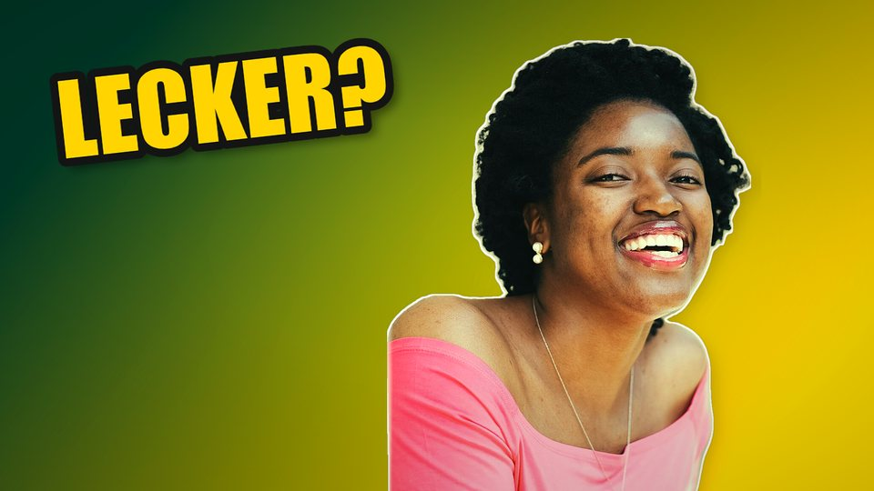</td>
    <td width="50%">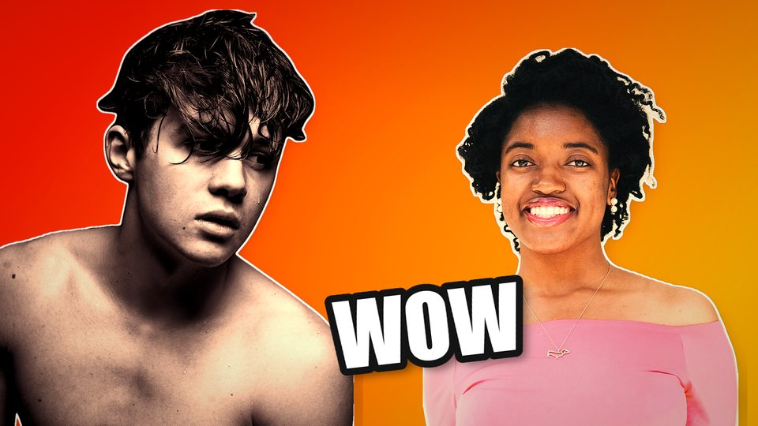</td>
  </tr>
  <tr>
    <td><b>Foto-Compositing:</b> dein Foto wird lokal freigestellt, mit Randkante und angeglichenem Licht auf den Hintergrund gesetzt.</td>
    <td><b>Mit Freunden:</b> jede Person aus deinem Profil kann mit ins Bild.</td>
  </tr>
  <tr>
    <td>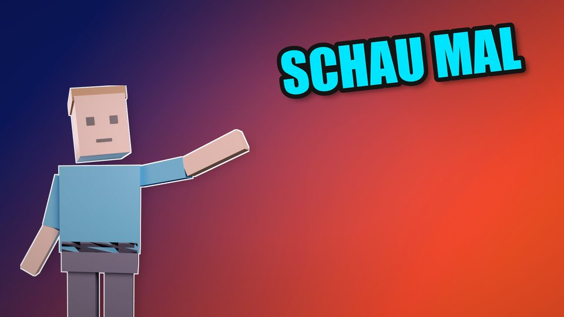</td>
    <td>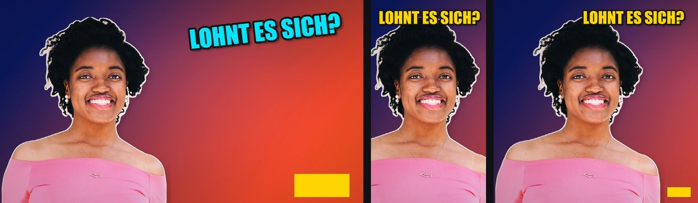</td>
  </tr>
  <tr>
    <td><b>Eigenes 3D-Modell:</b> VTuber- oder Spiel-Avatar als GLB, glTF, VRM oder FBX, in Blender posiert und beleuchtet.</td>
    <td><b>Jedes Format:</b> 16:9, 9:16 und 1:1 – der Text wird fürs neue Format neu gesetzt. Dazu PSD mit Ebenen.</td>
  </tr>
</table>

- **Vorbilder und Stilbuch je Kanal:** Thumbnails, die dir gefallen, per Datei, Ablegen, Zwischenablage oder
  YouTube-Link. Die App vermisst sie lokal, eine Bild-KI beschreibt sie genauer, daraus entsteht ein Stilbuch mit
  Regeln und Belegen. Du gewichtest, was dir wichtig ist.
- **„So ähnlich wie das hier“:** ein Vorbild nur für einen Auftrag, und du hakst an, was übernommen wird (Farben, Aufbau,
  Licht, Pose, Kamera, Textstil). Logos, Texte oder Figuren werden nie übernommen.
- **Minecraft-Welt:** die komplette 3D-Welt aus MoinStudio mit Skin, Posen, Mobs, Items und Licht. Texturen kommen aus
  deiner eigenen Spielinstallation, nie aus diesem Repository.
- **Reaction, Vorlage, aus dem Video:** das Original-Thumbnail mit dir daneben, du an der Stelle der Person in einem
  vorhandenen Thumbnail, oder starke Momente und Ideen direkt aus deinem Video.
- **Selbstprüfung:** Gesicht frei und im Bild, nichts Wichtiges angeschnitten, Text nie über Gesichtern, nicht leer
  oder überstrahlt – dazu die Bild-KI, wenn du eine hast. Fehler korrigiert die App vor dem Zeigen.
- **Änderungen in Worten:** „mehr Rot“, „Text größer“, „schau zur Kamera“.

## Schnitt

Rohvideo rein, fertiges Video raus. ContentStudio schneidet im Stil deiner Richtung, du schaust nur noch drüber.

<p align="center">
  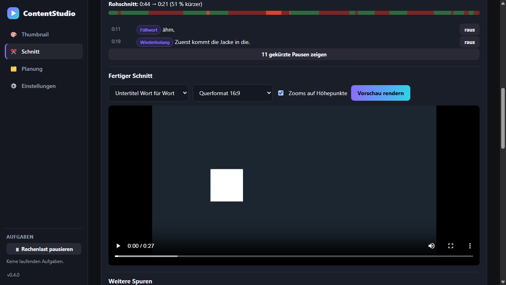
</p>

- **Transkript lokal:** faster-whisper in der Sprache deines Kontos, ohne Cloud; Kanalname und Fachbegriffe helfen beim
  Schreiben.
- **Rohschnitt nach Stil:** Pausen, Füllwörter, abgebrochene Sätze fliegen raus – bei Gaming und Comedy eng, bei Kochen,
  Bildung und Podcasts mit Luft. Jeder Schnitt lässt sich per Klick zurückholen.
- **Wünsche in Worten:** „Mach ein spannendes Intro“, „Zeitlupe beim lustigsten Moment“, „am Ende schwarz ausblenden“.
  Tempo, Standbild, Zoom, Wackeln, Farbe, Blitz, Blenden, Text, Bild, Geräusch, Zensur, Lautstärke und Intro – Texte in
  der Schrift deiner Marke.
- **Hochformat:** 9:16 für Shorts, Reels und TikTok; der Ausschnitt folgt Gesicht oder Bewegung, mit Facecam oben
  Gesicht und unten Bild.
- **Mehrere Spuren:** Facecam, Gameplay oder getrennter Ton werden am Ton automatisch ausgerichtet.
- **Export je Plattform:** YouTube, Shorts, TikTok, Reels, Facebook, X, Twitch, Kick, Podcast (M4A mit Kapiteln) –
  geprüft nach den Vorgaben der Plattform, mit Titel-, Text- und Kapitelvorschlag. Dazu Höhepunkte und Kurzvideos aus
  langen Streams.
- **In deinem Schnittprogramm weitermachen:** Premiere Pro, After Effects, DaVinci Resolve oder CapCut – mit Schnitten,
  Zooms, Texten, Markern und Untertiteln. Thumbnails gehen als Photoshop-Datei mit Ebenen raus. Ein Selbsttest in den
  Einstellungen prüft, ob es auf deinem Rechner klappt.

## Planung

Jedes Video von der Idee bis zur Veröffentlichung – ein Board je Konto, ein Kalender für alle.

<p align="center">
  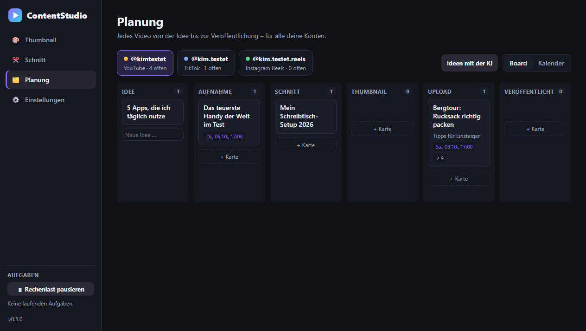
</p>

<table>
  <tr>
    <td width="50%">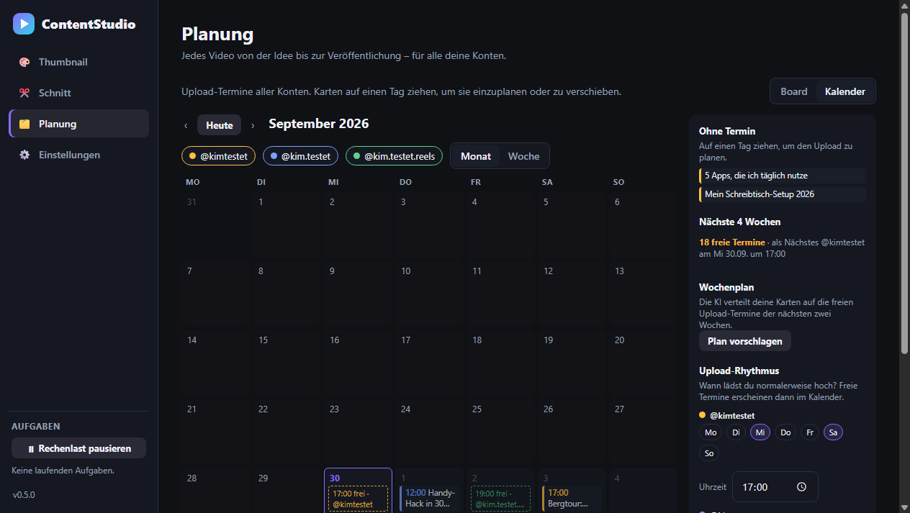</td>
    <td width="50%">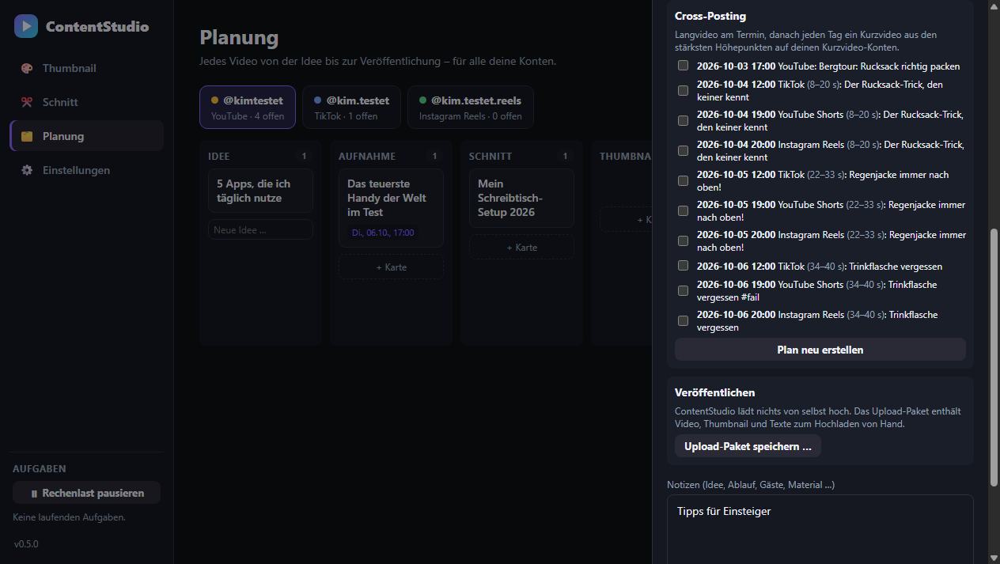</td>
  </tr>
  <tr>
    <td><b>Kalender:</b> Termine aller Konten, freie Plätze laut Upload-Rhythmus, Karten per Ziehen einplanen.</td>
    <td><b>Cross-Posting:</b> aus einem Langvideo wird ein Plan – welches Kurzvideo wann auf welcher Plattform.</td>
  </tr>
</table>

- **Karten rücken von selbst weiter:** Rohvideo schneiden, Thumbnail wählen, exportieren – die Karte wandert mit und
  übernimmt Titel, Text und Kapitel.
- **Ideen, Titel und Wochenplan mit der KI:** passend zu Richtung, Plattform und Sprache des Kontos; Titel halten die
  Regeln der Plattform ein (Länge, Hashtags).
- **Kein heimliches Hochladen:** Standard ist ein Upload-Paket mit Video, Thumbnail und Texten. Wer möchte, verbindet
  YouTube über die offizielle Anmeldung von Google – verschlüsselt gespeichert, jederzeit trennbar.
- **Mit PC und Laptop:** eine Datei je Karte, Konfliktkopien von iCloud oder OneDrive werden Feld für Feld zusammengeführt.
- **Aus Claude Desktop & Co.:** über MCP lassen sich Thumbnails, Schnitt (`video_edit`) und Planung (`planning`) auch
  per Chat steuern.

## Einstellungen

- **Creator-Profil:** Konten mit Plattform, Sprache, Richtung, Upload-Rhythmus, wie du im Thumbnail aussiehst, Freunde
  und Marke (Farben, Schrift, Logo). Ein Assistent fragt das beim ersten Start in Ruhe ab.
- **KI-Wege:** lokal, Abo über Codex-CLI, Desktop-Apps über MCP oder eigene Schlüssel – in deiner Reihenfolge, mit
  Kostenanzeige und Monatsbudget.
- **Hardware:** der Test stellt Blender, Encoder und Spracherkennung passend ein; der Leistungsbericht misst, wie schnell
  dein Rechner exportiert und transkribiert.
- **Programme:** Premiere, After Effects, DaVinci Resolve, CapCut und Photoshop werden erkannt, je mit Selbsttest.
- **Hochladen:** standardmäßig nie automatisch; optional YouTube über die offizielle Anmeldung.

## Grundsätze

| | |
|---|---|
| **Lokal und kostenlos zuerst** | Rechenintensives läuft auf deinem Rechner mit freien Werkzeugen (Blender, FFmpeg, rembg). Kein Pflicht-Cloud-Dienst, kein Konto bei ContentStudio. |
| **Fast jede Hardware** | Ein Hardware-Test stellt jedes Gerät selbst ein, bis hinunter zum reinen CPU-Betrieb. |
| **Deine KI, deine Zugänge** | Lokale Modelle (Ollama, LM Studio, llama.cpp), dein ChatGPT-Abo über die offizielle Codex-CLI, Claude Desktop und ChatGPT Desktop über MCP, oder eigene API-Schlüssel – verschlüsselt, mit Kostenanzeige vor jedem Aufruf. Oder ganz ohne KI. |
| **Freiform** | Jede Beschreibung soll umsetzbar sein. Listen sind Beispiele, nie die Grenze. |
| **Datenschutz** | Nichts verlässt deinen Rechner außer an den KI-Anbieter, den du gewählt hast. Keine Telemetrie. |

<p align="center">
  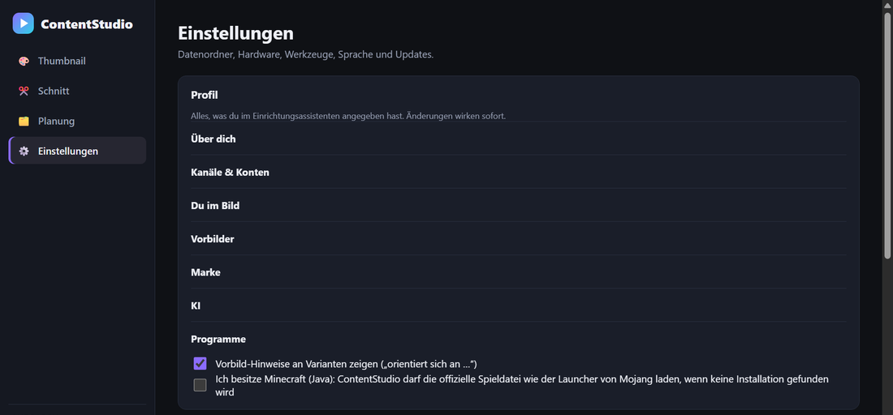
</p>

## Installieren

Lade den Installer der [neuesten Version](https://github.com/MoinMornhart/contentstudio/releases/latest) herunter
(`ContentStudio-Setup-x.y.z.exe`) und starte ihn – ohne Administratorrechte. Beim ersten Start führt ein Assistent in
zwölf Schritten durch Profil, Kanäle, Darstellung, Marke und KI. Updates kommen danach automatisch.

## Neueste Änderungen

<!-- CHANGELOG:START -->
- **0.7.5** (2026-10-05): Neuer Reiter Logo: Logos erstellen und verwalten, Logo mit Ecke und Größe in jedem Thumbnail
- **0.7.4** (2026-10-05): Thumbnail-Vorlage für jede Art von Bild: eigene Maske je Person, Hände, Ketten, Schlussprüfung mit Korrektur
- **0.7.3** (2026-10-05): Aus MoinStudio: Minecraft-Engine mit Grafik-Ebene und geteilten Bildern, Effekt-Bibliothek mit Greenscreen, Verlauf, Namensvorschläge
- **0.7.2** (2026-10-05): MoinStudio-Fehlerbehebungen übernommen: lange Videos, Cloud-Ordner, Media offline, KI-Zeitlimit; Orte und Gegenstände im Thumbnail
- **0.7.1** (2026-09-30): Fix: Foto-Thumbnails brachen zufällig ab; Leistungsbericht; Qualitätsrunde vorbereitet
<!-- CHANGELOG:END -->

## Entwicklung

```powershell
git clone https://github.com/MoinMornhart/contentstudio.git
cd contentstudio
git config core.hooksPath .githooks   # gitleaks-Scan vor jedem Push
npm install
npm run check        # Typprüfung, Lint, Tests, Build
npm start            # App starten
```

Aufbau und Entscheidungen: [docs/architecture.md](docs/architecture.md) · KI-Anbieter und ihre Bedingungen:
[docs/ki-anbieter.md](docs/ki-anbieter.md) · Datenquellen: [docs/datenquellen.md](docs/datenquellen.md)

## Lizenz und Bildnachweis

[MIT](LICENSE). Teile stammen aus MoinStudio (ebenfalls MIT), die Herkunft steht im Kopf der jeweiligen Datei.

Die Beispielfotos in `docs/bilder/` stammen von Wikimedia Commons und stehen unter CC0 (Liste in
[tests/fixtures/testfotos.json](tests/fixtures/testfotos.json)). Der 3D-Test-Avatar wird von
[tests/fixtures/avatar_bauen.py](tests/fixtures/avatar_bauen.py) erzeugt.
